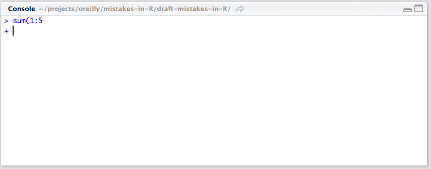

# Silly things

Now you should be setup for success in R -- you're using RStudio, can install packages and are working through RStudio projects. But there will still be lots of frustrating quirks to learn about R. And often your mistakes, you'll come to find, are silly little things. In this chapter we'll cover those common screwups in actual R coding

### Basics

R is very picky. Every `(` must be paired with a corresponding `)`. Variable names most be spelled correctly, and when passing a file name or other string to an R function, it must be surrounded by quotes (e.g. `'dir/file-name.csv'`). 

Usually, it's best to work in the RStudio Console to interactively run R commands. And while sometimes you'll get an error, other types the console will leave you hanging with an "+" while your cursor is blinking. Like here when I forget the second `)`:



This means your command is incomplete and RStudio is waiting. Just press the "esc" key.

### Strings as factors

Every programming language has basic data structures for numbers, strings and booleans. R is no different: there are `double`, `character` and `logical` data types. There is also the `list` for heterogeneous data. But the best known -- and most influential -- R data structrue is `data.frame`. A dataframe contains tabular data, like a spreadsheet. More precisely, it's a list of equal-length vectors. 

However, one annoying default with R is how it treats strings (or character) data in dataframes. Unless you specify otherwise, it interprets this data as a `factor`. A factor can be a useful data structure. A `factor` is a vector with only **pre-defined** values, and so it works well with categorical data (like `male`/`female` or `democrat`/`republican`). Yet often you do _not_ want your non-numeric data to be factors. It's better to have them as plain-old characters. 

This problem is often encountered when reading in data from an external data file. Let's import the file `common_names.csv`, which can be found at the [GitHub repository for this book](https://github.com/andrewflowers/how-to-make-mistakes-in-R). This is data on the 100 most common names in America, and came from a [story](https://fivethirtyeight.com/features/whats-the-most-common-name-in-america/) I wrote with my former colleague Mona Chalabi for [FiveThirtyEight](fivethirtyeight.com). The data has two columns, one for the name and the other (`perct_pop`) for it's share of the population.

Below we'll import the data using the "base R" function `read.csv` and then we'll attempt to calculate the number of characters in each name using the `nchar()` function. But it will fail. That's because the column `name` is not a charater data type. It's a factor, as we'll find out by using the helpful `str()` command, which tell us the structure of our dataframe.

```{r error= TRUE}
common_names <- read.csv("common_names.csv")
# Attempt to calculate characters in each name
nchar(common_names$name)
str(common_names)
```

This is frustrating and annoying. My advice is to have R, by default, interpret strings as charaters, not factors. There are several ways to accomplish this, a common one being to set the `stringsAsFactors` setting to `FALSE`. You can do this globally with the `options()` function, but I would **NOT** recommend that. Why? Becaue it can cause problems when sharing your code with others. You'd either be changing _their_ global settings, which isn't polite; or your code could break when they run it.

Scratching that, you have two options. You can set `stringsAsFactors == FALSE` directly in your function call, if that function allows it (like `read.csv` does). Once we do this and run the `str()` function, notice how the data type of `name` is now a character, not a factor. See here:

```{r}
common_names <- read.csv("common_names.csv", stringsAsFactors = FALSE)
str(common_names)
nchar(common_names$name)
```

But I'd argue there is an even better approach: use the `readr` package developed by Hadley Wickham. `readr` was installed with the `tidyverse` package we loaded earlier. It has lots of great functions for reading data into R. The analogous `readr` function to `read.csv` is `read_csv`. In addition to being faster, it interprets string data as characters (and not factors) **by default**. So no more typing `stringsAsFactors == FALSE`. Just use `readr`.

```{r}
library(readr)
common_names <- read_csv("common_names.csv")
str(common_names)
```

### Subsetting

Another common source of R mistakes comes when subsetting your data. Say you want to select a column from a data frame. Well, you have a few options. You can use the `$` or `[` operators. But a common mistake is to use the `$` operator with a _variable_ for the column yuo want to select. That is why you should use the `[` operator with variables. Let's try this out on the classic toy dataset `mtcars`, part of the `datasets` package installed with "base R."

```{r error = TRUE}
mtcars$mpg # This works
column_to_select <- 'wt'
mtcars$column_to_select # This does NOT work
mtcars['wt'] # This is how you use variables to subset
```

Notice how subsetting `mtcars` with `$` vs. `[` has a different output; the latter includes rownames. That's because `$` returns the column as a vector, whereas the `[` returns the column of the dataframe as what it is -- a list. If what you want is not a list, then you'll need to use the third type of subsetting operator, `[[`. Also, in addition to the `str()` function to examine the object, you can use `typeof()` too.

```{r error = TRUE}
# Subsetting for a list
mtcars['wt']
typeof(mtcars['wt'])

# Subsetting for a vector
mtcars[['wt']]
typeof(mtcars[['wt']])
```

### Missing values

R handles missing values with an `NA`, but it's often a source of frustration. Take the example below. Note: we're using the `c()` function -- short for "combine" -- to create a vector of numbers.

```{r error=TRUE}
sample_data <- c(23, 7, 19, NA, -4, 12, 7)

# Test for NAs
is.na(sample_data)
sum(sample_data)
mean(sample_data)
```

As you see, some R functions return `NA` by default if one element is an `NA`. To fix this, one must either filter out the `NA` values or set the `na.rm` parameter to `TRUE`, which removes them.

```{r error = TRUE}
# Filter out NAs
sum(sample_data[!is.na(sample_data)])

# Tell function to remove NAs before calculating
sum(sample_data, na.rm = TRUE)
```

One relevant warning about `NA` values: they don't appear by default in the useful `table()` function, which tallies the results of a single vector, factor or list. To have `table()` return `NA` values you must specify the `useNA` paramaeter to be `'ifany'` (in quotes).

```{r }
table(sample_data) # Notice the NA is missing
table(sample_data, useNA = 'ifany')
```

Enough of these silly mistakes. Let's move on to how to write more elegant R code.