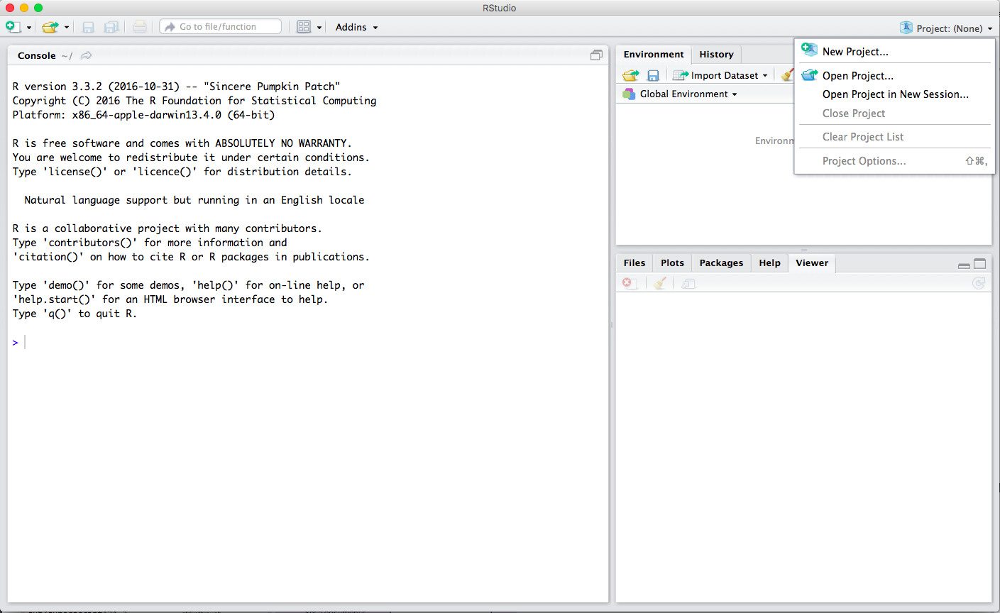
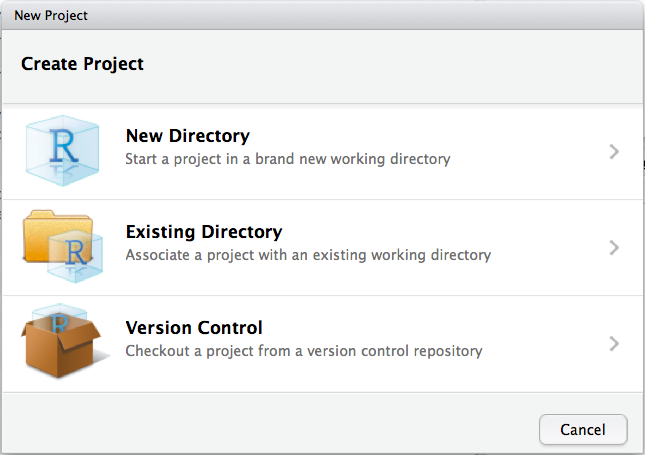
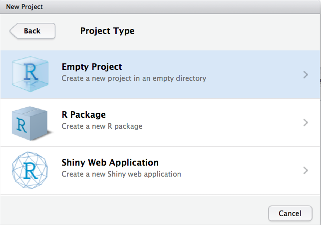
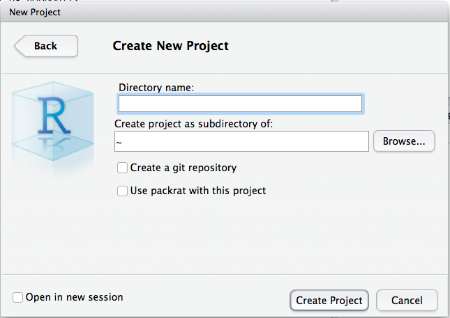

# Setup

Getting started with R can be frustrating. Actually, no, it’s _guaranteed_ to be frustrating at the beginning But that’s entirely normal! Take a deep breath, persevere through the initial confusion and know that it gets easier. I promise that you’ll be glad you did.

To make things easier on you, in this chapter we’ll cover the common beginner-level mistakes in just getting your R coding environment in order. (I’ll assume you’ve [installed R](https://cran.r-project.org/mirrors.html).)


### RStudio IDE

First things first: what IDE are using? _“ID-what?”_  you might say. An integrated development environment (IDE) is like a workstation. For your physical workstation, you probably prefer an ergonomic chair or maybe a modern standing desk. A good workstation can make a big difference in your productivity. Ditto for your digital workstation -- so take care in choosing. 

Now, you don’t have to use an IDE to write R code; you can execute R commands and write R scripts using the pre-built R framework. But I wouldn’t recommend it.

By far the most widely-used IDE for R is RStudio. If you haven’t yet, go [install Rstudio](https://www.rstudio.com/products/rstudio/download/). RStudio makes writing R code less of a headache.

### More than one way to install a package

R is a set of tools. “Base R” -- the pre-installed set of functions like `sum()` and `plot()` -- is like a starter toolbelt, with just a hammer and wrench. It’s the minimal tools you need to accomplish simple tasks. 

However, to do anything meaningful in R you need to install other R packages. Specifically, you need to install _and_ load R packages into your R library. Perhaps the most common mistake that R newbies make is loading a package _before_ installing it:

```{r error=TRUE}
# NOTE: there is no ‘RPACKAGE’ package

library(RPACKAGE)  


```

The `library()` function loads an already-installed package into your R environment -- the set of packages you’ve activated at the moment. But for it to work, you first need install it; and most often you do that with the `install.packages()` function. Let’s start by installing and loading the `tidyverse` package, which is really a collection of packages, with the package name in quotes like `’tidyverse’`. 

The two-step process goes like this:

```{r eval=FALSE}
# Step 1: Install the package
install.packages(‘tidyverse’)

# Step 2: load the package
library(tidyverse) 

# NOTE: quotes are optional for the library() function
```

You often will use the `install.packages()` function because it taps directly into [CRAN](https://cran.r-project.org/), the Comprehensive R Archive Network, where [thousands](https://cran.r-project.org/web/packages/available_packages_by_name.html) of R packages are approved and maintained. But this is not the only way to install an R package. 

Another common method is via GitHub, but to do that you first need another R package called `devtools`. So first we’ll install `devtools` the old-fashioned way and then use its nifty function to install a second package -- called `bookdown` -- directly via GitHub. Just use the `install_github()` funciton with the author's name, a `/` and the package name. Because the GitHub user `rstudio` is the author of the `bookdown` package, it looks like this:

```{r eval=FALSE}
# Install and load the devtools package
install.package(“devtools”)
library(devtools)

# Install the bookdown package (authored by rstudio) from GitHub
install_github("rstudio/bookdown") 
```

You could have installed `bookdown` through CRAN and the `install.packages()` function. But the `devtools` package, with its `install_github` function, allows you to broaden what R packages you can use. 

### Working directory confusion

Another common R mistake is not being aware of your **working directory**, or the file/folder on your computer from which you’re currently working. R has useful functions -- `getwd()` and `setwd()` -- for discovering and changing your working directory. And I’d also recommend the `dir()` function to list which files are within your current working directory. Below I use `getwd()` to list my current working directory and the files within it, and then I use `setwd()` with `..` to move one folder level higher in my directory.

```{r}
getwd()
dir()

# To move my working directory one folder higher:
setwd('..')
getwd()
```

If you've ever tried to import a data file -- like a `.csv` with data -- but get an erorr, it's probably because you've mistunderstood your working directory (or didn't correctly specifcy the path to your data file). See here for instance:

```{r error=TRUE}
data <- read.csv("my-data-file.csv")

# NOTE: my-data-file.csv is not in my current working directory

dir()
```

### RStudio Projects

There is an elegant fix to working directory headaches: [RStudio Projects](https://support.rstudio.com/hc/en-us/articles/200526207-Using-Projects). Projects automatically set your working directory to the location of the project, and provide a neat way to organize all your files (`.R` scripts, data files and so on). To create a project within RStudio, click in the top-right corner. 



You'll then choose whether to create a new directory (or folder) to hold the project, or using an existing one.



Most likely, you'll want to create an empty project.



Then you'll specify the project name. Voila! Now you're all set.



### _The_ biggest R mistake

And that brings up what is probably the biggest R mistake you can make: **not using an R package that suits your problem, or using the wrong package**. Unfortunately, there is no error message for this; you learn it through experience. 

For data science problems, though, a good place to start is the `tidyverse` package we just loaded. We’ll be referencing its various packages throughout this book. But when in doubt, look there first.